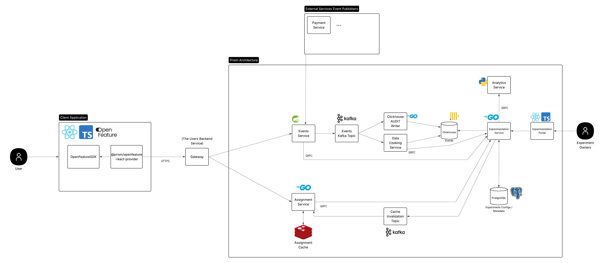

# Prism

Prism is an MVP self-hostable Experimentation Platform that I have built for the fulfillment of my undergraduate degree in BSc (Hons) Digital & Technology Solutions (Software Engineering).

## Highlights

- **Deterministic Experiment and Variant Assignment** - Bucket and Variant-Level Hash functions
- **Polyglot microservices** — Go, Python, Java & TypeScript communicating over gRPC + Kafka
- **Event & Metric Catalog With Dynamic QueryBuilder** — Metrics can be defined and re-used across experiments
- **OpenFeature React Provider** React OpenFeature Assignment Provider
- **Custom Go E2E experiment simulator** — deterministic experiment simulator for validating the platform end-to-end

## Architecture

## Repository layout

| Path                          | Description                                                                                                           |
| ----------------------------- | --------------------------------------------------------------------------------------------------------------------- |
| `services/`                   | The 7 core microservices (experimentation, assignment, events, data-cooking, clickhouse-writer, stats-engine, portal) |
| `services/protos/`            | Shared gRPC protobuf definitions                                                                                      |
| `openfeature-provider-react/` | OpenFeature provider for client-side assignment                                                                       |
| `libs/`                       | Shared Go modules (microbatcher, models, logger, hashing)                                                             |
| `tools/`                      | Experiment simulator, ingest evaluator, Gatling load tests, bucket finder                                             |
| `infrastructure/`             | Docker Compose, env templates, DB migrations                                                                          |
| `docs/`                       | Docusaurus documentation site                                                                                         |
| `requirements/`               | Functional & non-functional requirements specs                                                                        |

## Tech stack

**Backend:** Go · Java (Spring) · Python · gRPC · Kafka · ClickHouse · Postgres · Redis
**Frontend:** TypeScript · React · OpenFeature
**Infra/tooling:** Docker · Terraform · GitHub Actions · Gatling · JUnit · Jest

## Testing

CI runs on every push via GitHub Actions: unit tests, integration tests (Testcontainers). Failing actions will prevent merges into main.

The experiment simulator can be run locally to validate the system.

## Documentation

- Developer Docs: https://dan-sones.github.io/prism/docs/developers/data-cooking-service
- User Docs / Guides: https://dan-sones.github.io/prism/docs/experiment-owners/metrics-catalog
